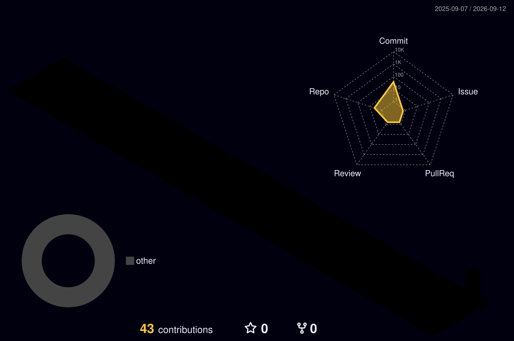

<h1 align="center">Hi, I'm RAAGAVI A.P</h1>
<h3 align="center">AI & Data Science Student | ML | Learning Full Stack Development</h3>

  

### About Me
- 3rd year student, Artificial Intelligence & Data Science
- Currently building ML projects and learning full-stack development
- Currently learning: Machine Learning, moving into React next for full stack
- Ask me about: Python, Java, Machine Learning, Data Analysis
- Reach me: itz.apraagavi@gmail.com
- LinkedIn: [linkedin.com/in/raagavi-ap](https://www.linkedin.com/in/raagavi-ap/)

### Tech Stack

  

### 3D Contribution Graph

### Featured Project

**[AgriShield](#)**

Bilingual (English/Tamil) crop risk advisory for tomato farmers, using live weather data with rule-based and AI predictions to warn against pest and disease risk, plus localized crop recommendations based on soil type.

**Language used:**
Python

### What I'm Working On
- Building end-to-end ML projects (dataset → model → deployment)
- Preparing for placements — DSA + ML fundamentals
- Working through Andrew Ng's Machine Learning Specialization
- Learning React to go full stack alongside Java

### Certifications
- 🎓 Infosys Springboard — HTML
- 🎓 Infosys Springboard — Python
- 🎓 Skillrack — SQL

### GitHub Metrics

  

  

 

  

